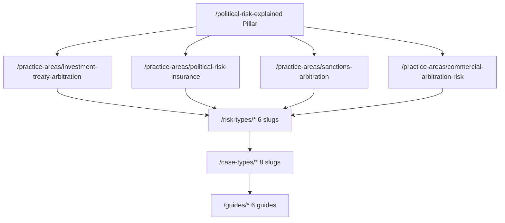
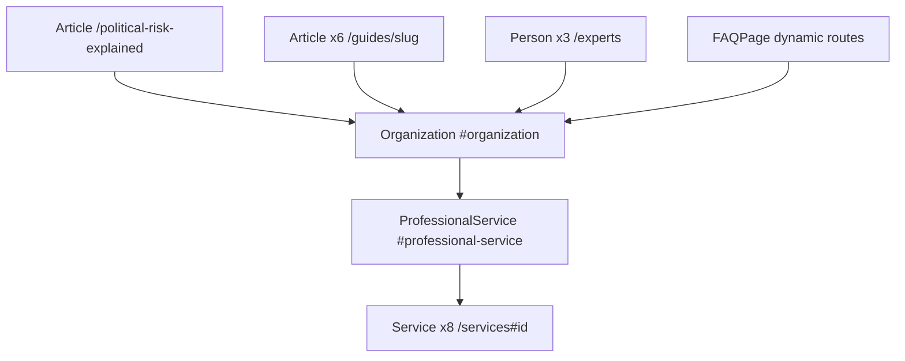

# SEO Architecture — politicalriskexpert.com

**Canonical domain:** `https://www.politicalriskexpert.com`  
**Site name:** Political Risk Expert  
**Locale:** `en_GB` (UK international arbitration counsel, political risk insurance counsel, commercial litigators)  
**Role:** Lead-generation site for political risk expert witnesses in investment treaty arbitration, PRI claims, sanctions disputes, and commercial arbitration

This document is the single source of truth for keyword strategy, content clusters, internal linking, GEO (Generative Engine Optimization), off-page SEO, schema architecture, and launch deployment for politicalriskexpert.com. All slugs and URLs align with the canonical build-spec naming convention.

**Implementation status:** This document reflects the **target** architecture (June 2026). The codebase is currently a greenfield scaffold. Slugs, metadata, internal linking matrix, glossary anchors, and sitemap inventory described here are the implementation targets. Run `npm run seo:generate && npm run seo:verify` after content or route changes.

---

## 1. Keyword Strategy

### Tier 1 — Transactional

**Target pages:** homepage, services, practice areas, case types, qualifications, contact.

| Keyword | Primary URL |
|---------|-------------|
| political risk expert witness UK | `/` |
| political risk expert UK | `/`, `/what-is-a-political-risk-expert` |
| political risk expert arbitration UK | `/`, `/practice-areas/investment-treaty-arbitration` |
| investment treaty expert witness UK | `/practice-areas/investment-treaty-arbitration`, `/case-types/icsid-investment-treaty-claim` |
| expropriation expert witness UK | `/risk-types/expropriation-nationalisation`, `/case-types/expropriation-claim` |
| political risk insurance expert UK | `/practice-areas/political-risk-insurance`, `/case-types/political-risk-insurance-claim` |
| sanctions expert witness arbitration | `/practice-areas/sanctions-arbitration`, `/case-types/sanctions-contract-dispute` |
| ICSID expert witness UK | `/case-types/icsid-investment-treaty-claim` |
| FET breach expert witness UK | `/risk-types/fair-equitable-treatment-breach` |
| resource nationalism expert witness | `/risk-types/resource-nationalism`, `/case-types/resource-nationalism-mining` |

### Tier 2 — Informational

**Target pages:** definition page, pillar page, guides, glossary, FAQ.

| Keyword | Primary URL |
|---------|-------------|
| what is a political risk expert witness | `/what-is-a-political-risk-expert` |
| political risk in investment treaty arbitration | `/political-risk-explained`, `/guides/investment-treaty-arbitration-guide` |
| sanctions arbitration expert evidence 2025 2026 | `/guides/sanctions-arbitration-2025-guide`, `/political-risk-explained#sanctions-landscape` |
| expropriation expert witness ICSID UK | `/case-types/icsid-investment-treaty-claim`, `/risk-types/expropriation-nationalisation` |
| fair equitable treatment expert analysis | `/risk-types/fair-equitable-treatment-breach`, `/glossary#fair-and-equitable-treatment-fet` |
| political risk insurance coverage dispute expert | `/guides/political-risk-insurance-guide`, `/practice-areas/political-risk-insurance` |
| Energy Charter Treaty sunset provision expert | `/guides/ect-sunset-provision-guide`, `/case-types/energy-charter-treaty-dispute` |
| UK investor state arbitration 2025 2026 | `/case-types/uk-investor-state-arbitration`, `/guides/uk-investor-state-guide` |
| resource nationalism expert witness mining | `/case-types/resource-nationalism-mining`, `/guides/resource-nationalism-guide` |
| Chorzów Factory standard political risk | `/glossary#chorzow-factory-standard`, `/risk-types/expropriation-nationalisation` |

### Tier 3 — Long-tail

**Target pages:** case types, guides, risk types, practice areas.

| Keyword | Primary URL(s) |
|---------|----------------|
| ICSID investment treaty political risk expert UK | `/case-types/icsid-investment-treaty-claim`, `/guides/investment-treaty-arbitration-guide` |
| LCIA ICC sanctions arbitration expert | `/case-types/lcia-icc-political-risk-arbitration`, `/case-types/sanctions-contract-dispute` |
| West Africa mining resource nationalism expert | `/guides/resource-nationalism-guide`, `/risk-types/resource-nationalism` |
| Energy Charter Treaty withdrawal UK expert | `/guides/ect-sunset-provision-guide`, `/case-types/energy-charter-treaty-dispute` |
| expropriation fair market value expert witness | `/risk-types/expropriation-nationalisation`, `/glossary#fair-market-value` |
| political violence insurance claim expert UK | `/risk-types/political-violence-instability`, `/case-types/political-risk-insurance-claim` |
| currency inconvertibility expert witness PRTC | `/risk-types/currency-convertibility-transfer`, `/guides/political-risk-insurance-guide` |
| UK BIT investor state expert witness 2025 | `/guides/uk-investor-state-guide`, `/case-types/uk-investor-state-arbitration` |
| blocking regulation sanctions arbitration expert | `/practice-areas/sanctions-arbitration`, `/glossary#blocking-regulation` |
| Woodhouse West Cumbria mining ECT expert | `/case-types/uk-investor-state-arbitration`, `/guides/uk-investor-state-guide` |

### Keyword → URL implementation reference

| Cluster | URL pattern | Meta source |
|---------|-------------|-------------|
| Brand / transactional | `/` | Page-level `createMetadata()` |
| Definition / GEO pillar | `/what-is-a-political-risk-expert`, `/political-risk-explained` | Page-level metadata |
| Practice area transactional | `/practice-areas/{slug}` | `metaTitle`, `metaDescription`, `h1` in `data/practice-areas.ts` |
| Risk type transactional | `/risk-types/{slug}` | `data/risk-types.ts` |
| Case-type transactional | `/case-types/{slug}` | `data/case-types.ts` |
| Informational guides | `/guides/{slug}` | `data/guides.ts` |
| Process / standards | `/how-to-instruct`, `/qualifications`, `/fees` | Page-level metadata |
| Services | `/services` | `data/services.ts` |
| Expert profiles | `/experts` | `data/experts.ts` |

**Route note:** `/what-is-a-political-risk-expert` is the canonical definition URL for "what is a political risk expert witness" queries. `/political-risk-explained` is the master GEO pillar for political risk in litigation and arbitration.

---

## 2. Unique Content Assets

Five differentiators that no competitor site currently combines. Each asset must appear on at least two indexable URLs with consistent citeable facts for GEO and digital PR.

| Asset | Primary URLs | Citeable fact |
|-------|--------------|---------------|
| UK as ISDS respondent — Woodhouse/Fridman | `/case-types/uk-investor-state-arbitration`, `/guides/uk-investor-state-guide`, `/political-risk-explained#uk-investor-state` | Two active investor-state claims against the UK government (Woodhouse/West Cumbria Mining and Mikhail Fridman, 2025–2026) |
| ECT sunset provision guide (April 2045) | `/guides/ect-sunset-provision-guide`, `/case-types/energy-charter-treaty-dispute`, `/faq` | UK ECT withdrawal completed 2025; sunset provision protects existing investments until April 2045 |
| Sanctions 25% of ICC Q1 2024 | `/political-risk-explained#sanctions-landscape`, `/guides/sanctions-arbitration-2025-guide`, `/practice-areas/sanctions-arbitration` | Nearly 25% of ICC cases in Q1 2024 involved sanctions; trend expected through 2026 |
| Resource nationalism 2025–2026 surge | `/guides/resource-nationalism-guide`, `/risk-types/resource-nationalism`, `/political-risk-explained#resource-nationalism` | Mining licence revocations and forced renegotiation in West Africa, Latin America, and Central Asia |
| UK BIT network — 80+ bilateral treaties | `/guides/uk-investor-state-guide`, `/guides/investment-treaty-arbitration-guide`, `/glossary#bilateral-investment-treaty-bit` | Over 80 BITs; no standalone national FDI legislation; foreign investors may bring ISDS claims against the UK |

### Content clusters



### Hub 1: Investment treaty arbitration

| Role | URL |
|------|-----|
| Practice area | `/practice-areas/investment-treaty-arbitration` |
| Guide | `/guides/investment-treaty-arbitration-guide` |
| Case types | `/case-types/icsid-investment-treaty-claim`, `/case-types/uk-investor-state-arbitration`, `/case-types/energy-charter-treaty-dispute` |
| Risk types | `/risk-types/expropriation-nationalisation`, `/risk-types/fair-equitable-treatment-breach` |
| Glossary | `/glossary#bilateral-investment-treaty-bit`, `/glossary#energy-charter-treaty-ect`, `/glossary#chorzow-factory-standard` |

### Hub 2: Political risk insurance

| Role | URL |
|------|-----|
| Practice area | `/practice-areas/political-risk-insurance` |
| Guide | `/guides/political-risk-insurance-guide` |
| Case type | `/case-types/political-risk-insurance-claim` |
| Risk types | `/risk-types/political-violence-instability`, `/risk-types/currency-convertibility-transfer`, `/risk-types/expropriation-nationalisation` |
| Glossary | `/glossary#political-risk-trade-credit-and-political-violence-prtc-insurance`, `/glossary#currency-inconvertibility` |

### Hub 3: Sanctions arbitration

| Role | URL |
|------|-----|
| Practice area | `/practice-areas/sanctions-arbitration` |
| Guide | `/guides/sanctions-arbitration-2025-guide` |
| Case types | `/case-types/sanctions-contract-dispute`, `/case-types/lcia-icc-political-risk-arbitration` |
| Risk type | `/risk-types/sanctions-regulatory-risk` |
| GEO anchor | `/political-risk-explained#sanctions-landscape` |
| Glossary | `/glossary#blocking-regulation`, `/glossary#ofsi-uk-sanctions-authority` |

### Hub 4: Commercial arbitration / resource nationalism

| Role | URL |
|------|-----|
| Practice area | `/practice-areas/commercial-arbitration-risk` |
| Guide | `/guides/resource-nationalism-guide` |
| Case type | `/case-types/resource-nationalism-mining`, `/case-types/expropriation-claim` |
| Risk type | `/risk-types/resource-nationalism` |
| GEO anchor | `/political-risk-explained#resource-nationalism` |

### Cross-cutting process hub

| Role | URL |
|------|-----|
| Master pillar | `/political-risk-explained` |
| Definition | `/what-is-a-political-risk-expert` |
| Instruction | `/how-to-instruct` |
| Qualifications | `/qualifications` |
| Fees | `/fees` |
| FAQ | `/faq` |

### Internal linking rules

#### Rule A: Every `/practice-areas/[slug]` must link to:

- `/political-risk-explained`
- At least 2 relevant `/risk-types/[slug]` pages
- At least 1 relevant `/case-types/[slug]` page
- At least 1 relevant `/guides/[slug]` page
- `/how-to-instruct`
- `/contact`

#### Rule B: Every `/risk-types/[slug]` must link to:

- Parent `/practice-areas/[slug]` page
- At least 1 relevant `/case-types/[slug]` page
- At least 1 relevant `/guides/[slug]` page (where applicable)
- `/how-to-instruct`
- `/contact`

#### Rule C: Every `/case-types/[slug]` must link to:

- Relevant `/practice-areas/[slug]` page(s)
- Relevant `/risk-types/[slug]` page(s)
- `/how-to-instruct`
- `/contact`

#### Rule D: Every `/guides/[slug]` must link to:

- Relevant `/practice-areas/[slug]` page(s)
- `/political-risk-explained`
- `/how-to-instruct`
- `/contact`

#### Rule E: `/political-risk-explained` must link to:

- All 4 `/practice-areas/[slug]` pages
- All 6 `/risk-types/[slug]` pages
- Top 3 guides: `investment-treaty-arbitration-guide`, `sanctions-arbitration-2025-guide`, `uk-investor-state-guide`
- `/how-to-instruct`
- `/contact`

#### Rule F: Homepage must link to:

- All 4 practice areas
- `/political-risk-explained`
- Top 4 risk types: expropriation, sanctions, FET, resource nationalism
- `/how-to-instruct`
- `/contact`

**Enforcement:** populate `relatedLinks` in `data/related-links.ts` from [Appendix D](#appendix-d-internal-linking-matrix). Use descriptive anchor text (e.g. "Energy Charter Treaty sunset provision expert evidence" not "click here").

**Cross-linking priority:** political-risk-explained pillar → practice area → risk type → case type → guide → contact.

---

## 3. GEO Optimization Targets

Content structured for AI citation and featured snippets: definition-first, tables, numbered steps, citeable legal standards.

| # | GEO target | URL | Required extractable artifact |
|---|------------|-----|------------------------------|
| 1 | Three legal contexts table | `/political-risk-explained` | Context / Forum / Expert Role / Primary Issues table |
| 2 | Sanctions arbitration landscape 2025–2026 | `/political-risk-explained#sanctions-landscape`, `/guides/sanctions-arbitration-2025-guide` | 25% ICC stat, Russia/Ukraine, Iran 2025 re-sanctions, blocking regulations |
| 3 | UK investor-state cases table | `/case-types/uk-investor-state-arbitration`, `/guides/uk-investor-state-guide` | Woodhouse/West Cumbria Mining + Fridman rows; 80+ BIT network; NSI Act 2021 |
| 4 | ECT withdrawal and sunset provision | `/guides/ect-sunset-provision-guide`, `/case-types/energy-charter-treaty-dispute` | Timeline table: withdrawal 2025 → sunset April 2045 |
| 5 | Resource nationalism recent cases | `/guides/resource-nationalism-guide`, `/risk-types/resource-nationalism` | Regional case table (West Africa, Latin America, Central Asia) |
| 6 | IBA Rules Art 5/6 in political risk arbitration | `/qualifications`, `/political-risk-explained#iba-rules`, `/how-to-instruct` | Party experts (Art 5) vs tribunal-appointed (Art 6); CPR Part 35 cross-reference |

### GEO content rules

- Lead with a direct answer paragraph (40 to 60 words) before depth.
- Tables use `<table>` with `<caption>` and header row for accessibility and parsing.
- Include source citations where legal standards, treaty provisions, or tribunal statistics are cited.
- Avoid gating key factual content behind accordions only.

### Three legal contexts table (GEO #1), required rows

| Context | Forum | Expert Role | Primary Issues |
|---------|-------|-------------|----------------|
| Investment treaty arbitration | ICSID, LCIA, ICC, UNCITRAL | Explain political context of host state conduct | Expropriation, FET, political violence |
| Political risk insurance | LCIA, ICC, Commercial Court | Establish whether insured political risk event occurred | Coverage trigger, cause of loss |
| Sanctions arbitration | LCIA, ICC, Commercial Court | Analyse sanctions regime and impact on contract | Force majeure, frustration, enforcement |

### Sanctions landscape table (GEO #2), required elements

| Element | Content requirement |
|---------|---------------------|
| ICC statistic | Nearly 25% of ICC cases in Q1 2024 involved sanctions |
| Russia/Ukraine | Primary sanctions regime driving commercial and investment disputes |
| Iran 2025 | Re-sanctions and enforcement complexity |
| Blocking regulations | EU/UK blocking regulations vs US secondary sanctions interaction |
| Expert role | Geopolitical context, regulatory framework, impact on contractual performance |

### UK investor-state cases table (GEO #3), required rows

| Case | Claimant | Issue | Expert evidence focus |
|------|----------|-------|----------------------|
| Woodhouse / West Cumbria Mining | West Cumbria Mining | UK government decision affecting mining investment | Political and regulatory context of UK government intervention |
| Mikhail Fridman | Mr Mikhail Fridman | UK government measures affecting qualifying investment | Policy context, NSI Act 2021, treaty breach analysis |
| BIT network | — | Over 80 bilateral investment treaties | UK's ISDS obligations despite no standalone FDI legislation |

### ECT sunset timeline (GEO #4), required rows

| Date / Event | Effect |
|--------------|--------|
| 2025 | UK completes withdrawal from Energy Charter Treaty |
| April 2045 | Sunset provision expires; existing qualifying investments lose ECT protection |
| Ongoing | ECT expert evidence remains relevant for disputes involving pre-withdrawal investments |

### Resource nationalism regional table (GEO #5), required rows

| Region | Trend | Example dispute types |
|--------|-------|----------------------|
| West Africa | Mining licence revocations (Guinea, Mali, Burkina Faso) | ICSID claims, commercial arbitration |
| Latin America | Energy nationalism, windfall taxes | BIT claims, contract renegotiation disputes |
| Central Asia | Infrastructure and resource control measures | Expropriation and FET claims |

### IBA Rules Art 5/6 comparison (GEO #6), required elements

| Rule | Role | Application in political risk cases |
|------|------|-------------------------------------|
| IBA Rules Art 5 | Party-appointed experts | Primary route: political risk expert instructed by claimant or respondent |
| IBA Rules Art 6 | Tribunal-appointed experts | Tribunal may appoint where political context requires independent analysis |
| CPR Part 35 | UK court proceedings | Expert's duty to the court; applies in Commercial Court and TCC political risk cases |

---

## 4. Off-Page SEO Targets

### Directories (listing submissions)

| Directory | URL | Target page to link |
|-----------|-----|---------------------|
| jspubs.com | [jspubs.com](https://www.jspubs.com) | `/`, `/qualifications` |
| Academy of Experts | Academy of Experts directory | `/qualifications`, `/how-to-instruct` |
| EWI (Expert Witness Institute) | [ewi.org.uk](https://www.ewi.org.uk) | `/qualifications`, `/fees` |
| GAR expert directory | Global Arbitration Review | `/`, `/practice-areas/*` |

**Submission tracking template:**

| Directory | Owner | Submitted | Live URL | Referral sessions/mo |
|-----------|-------|-----------|----------|----------------------|
| jspubs.com | | | | |
| Academy of Experts | | | | |
| EWI | | | | |
| GAR expert directory | | | | |

### Publications (citations / guest content)

| Publication | Focus |
|-------------|-------|
| Global Arbitration Review (GAR) | Investment treaty arbitration, sanctions, ISDS, expert evidence |
| Financier Worldwide | Political risk, PRI, cross-border disputes |
| A&O Shearman arbitration blog | Sanctions, investment treaty, commercial arbitration |
| ICSID Review | ICSID procedure, expropriation, FET, damages |
| Kluwer Arbitration Blog | Investment treaty, ECT, resource nationalism, UK ISDS |

**Outreach KPI template:**

| Publication | Piece title | Published | Backlink URL | Domain rating |
|-------------|-------------|-----------|--------------|---------------|
| | | | | |

### Digital PR angles

1. **UK as ISDS Respondent: What the Woodhouse and Fridman Cases Mean** (supports `/guides/uk-investor-state-guide`, GEO #3, Unique Asset #1)
2. **Sanctions Now 25% of ICC Cases: The Expert Evidence Response** (supports `/guides/sanctions-arbitration-2025-guide`, GEO #2, Unique Asset #3)
3. **Energy Charter Treaty After UK Withdrawal: The April 2045 Horizon** (supports `/guides/ect-sunset-provision-guide`, GEO #4, Unique Asset #2)
4. **Resource Nationalism 2025–2026: West Africa, Latin America and the ICSID Response** (supports `/guides/resource-nationalism-guide`, GEO #5, Unique Asset #4)

---

## 5. Deployment Checklist

| Task | Implementation | Status |
|------|----------------|--------|
| Vercel deployment | Connect repo; production branch deploy | Pending |
| DNS: `politicalriskexpert.com` → www | Registrar CNAME + `middleware.ts` apex 301 | Pending |
| `NEXT_PUBLIC_SITE_URL` / `SITE_URL` | `https://www.politicalriskexpert.com` in `lib/constants.ts` | Pending |
| Contact form → GHL webhook | `/api/ghl-webhook` + `netlify/functions/ghl-webhook.js` or Vercel equivalent | Pending |
| `GOOGLE_SITE_VERIFICATION` | `metadata.verification.google` in `app/layout.tsx` | Pending |
| `BING_SITE_VERIFICATION` | `metadata.other` in layout | Pending |
| `NEXT_PUBLIC_GA_MEASUREMENT_ID` | Analytics component (consent-gated) | Pending |
| `html lang="en-GB"` | Root layout `<html lang="en-GB">` | Target |
| `hreflang` | `en-GB`, `en-US`, `x-default` in `alternates.languages` | Target |
| Submit sitemap | GSC + Bing Webmaster: `/sitemap.xml` | Pending (post-deploy) |
| Google Search Console | Domain property for politicalriskexpert.com | Pending (post-deploy) |
| LinkedIn company page | `PoliticalRiskExpert` → `sameAs` in Organization schema | Pending |
| GAR directory submission | GAR expert directory | Manual post-launch |
| Academy of Experts | Directory listing | Manual post-launch |
| EWI | Expert Witness Institute listing | Manual post-launch |

**Canonical and robots:**

- All pages: canonical via `createMetadata()` in `lib/metadata.ts`
- Staging/preview: `noindex: true` on non-production hosts
- Production: `app/robots.ts` allow `/`, point to sitemap
- Exclude from sitemap: `/contact`, `/thank-you`, `/privacy`, `/terms`

**Target middleware pattern:**

```ts
const PRIMARY_HOST = "www.politicalriskexpert.com";
const PRIMARY_ORIGIN = "https://www.politicalriskexpert.com";
const REDIRECT_HOSTS = new Set(["politicalriskexpert.com"]);
```

**Environment variables (all):**

| Variable | Purpose |
|----------|---------|
| `NEXT_PUBLIC_SITE_URL` | Canonical site URL (`https://www.politicalriskexpert.com`) |
| `NEXT_PUBLIC_FORMSPREE_FORM_ID` | Contact form (Formspree fallback) |
| `GHL_WEBHOOK_URL` | GHL Inbound Webhook URL for workflow triggers |
| `GHL_API_KEY` | GHL Location API key or Private Integration Token |
| `GHL_LOCATION_ID` | GHL sub-account / location ID |
| `GHL_CUSTOM_FIELD_BUSINESS_NAME_ID` | Optional GHL custom field UUID |
| `GHL_CUSTOM_FIELD_SERVICE_INTEREST_ID` | Optional GHL custom field UUID |
| `GHL_CUSTOM_FIELD_MESSAGE_ID` | Optional GHL custom field UUID |
| `GOOGLE_SITE_VERIFICATION` | Search Console verification |
| `BING_SITE_VERIFICATION` | Bing Webmaster verification |
| `NEXT_PUBLIC_GA_MEASUREMENT_ID` | Google Analytics 4 |

**Reference implementation:** `persecution-expert/app/layout.tsx`, `persecution-expert/lib/metadata.ts`, `persecution-expert/middleware.ts`

---

## Appendix A: Full URL Inventory (~45 routes)

### Static and hub pages (14 indexable)

| URL | Sitemap priority |
|-----|------------------|
| `/` | 1.0 |
| `/political-risk-explained` | 0.95 |
| `/practice-areas` | 0.93 |
| `/risk-types` | 0.92 |
| `/case-types` | 0.90 |
| `/what-is-a-political-risk-expert` | 0.90 |
| `/services` | 0.90 |
| `/qualifications` | 0.88 |
| `/how-to-instruct` | 0.88 |
| `/fees` | 0.87 |
| `/faq` | 0.87 |
| `/guides` | 0.87 |
| `/experts` | 0.85 |
| `/glossary` | 0.75 |

### Dynamic pages (28)

| Pattern | Count | Sitemap priority |
|---------|-------|------------------|
| `/practice-areas/{slug}` | 4 | 0.92 |
| `/risk-types/{slug}` | 6 | 0.90 |
| `/case-types/{slug}` | 8 | 0.88 |
| `/guides/{slug}` | 6 | 0.82 |

### Legal / utility (noindex or excluded)

| URL | Robots |
|-----|--------|
| `/contact` | Excluded from sitemap |
| `/privacy` | noindex, follow |
| `/terms` | noindex, follow |
| `/thank-you` | noindex, nofollow |

**Total indexable URLs:** ~45 (excluding `/contact`, `/thank-you`, `/privacy`, `/terms`).

### Practice area slugs (4)

`investment-treaty-arbitration`, `political-risk-insurance`, `sanctions-arbitration`, `commercial-arbitration-risk`

### Risk type slugs (6)

`expropriation-nationalisation`, `fair-equitable-treatment-breach`, `sanctions-regulatory-risk`, `political-violence-instability`, `currency-convertibility-transfer`, `resource-nationalism`

### Case type slugs (8)

`icsid-investment-treaty-claim`, `lcia-icc-political-risk-arbitration`, `political-risk-insurance-claim`, `sanctions-contract-dispute`, `expropriation-claim`, `resource-nationalism-mining`, `uk-investor-state-arbitration`, `energy-charter-treaty-dispute`

### Guide slugs (6)

`investment-treaty-arbitration-guide`, `sanctions-arbitration-2025-guide`, `political-risk-insurance-guide`, `resource-nationalism-guide`, `uk-investor-state-guide`, `ect-sunset-provision-guide`

---

## Appendix B: Schema Architecture Summary

### Root entity

```json
{
  "@type": "Organization",
  "@id": "https://www.politicalriskexpert.com/#organization",
  "name": "Political Risk Expert",
  "url": "https://www.politicalriskexpert.com",
  "sameAs": ["https://www.linkedin.com/company/PoliticalRiskExpert"]
}
```

### Schema graph overview



### Schema by route type

| Route | Schema types |
|-------|--------------|
| `/` | Organization, ProfessionalService, WebSite, SearchAction |
| `/political-risk-explained` | Organization, Article, BreadcrumbList |
| `/what-is-a-political-risk-expert` | Organization, Article, BreadcrumbList, FAQPage |
| `/practice-areas/[slug]` | Organization, BreadcrumbList, FAQPage (if faqs) |
| `/risk-types/[slug]` | Organization, BreadcrumbList, FAQPage (if faqs) |
| `/case-types/[slug]` | Organization, BreadcrumbList, FAQPage (if faqs) |
| `/guides/[slug]` | Organization, Article, BreadcrumbList |
| `/services` | Organization, Service ×8, BreadcrumbList |
| `/qualifications` | Organization, BreadcrumbList |
| `/how-to-instruct` | Organization, BreadcrumbList |
| `/faq` | Organization, FAQPage, BreadcrumbList |
| `/experts` | Organization, Person ×3, BreadcrumbList |
| `/glossary` | Organization, BreadcrumbList |

**Helpers (target):** `lib/schema.ts`, `components/seo/PageJsonLd.tsx`, `components/ui/JsonLd.tsx`

### Sitemap priorities

| Route family | Priority |
|--------------|----------|
| `/` | 1.0 |
| `/political-risk-explained` | 0.95 |
| `/practice-areas` (hub) | 0.93 |
| `/practice-areas/[slug]` | 0.92 |
| `/risk-types` (hub) | 0.92 |
| `/risk-types/[slug]` | 0.90 |
| `/case-types` (hub) | 0.90 |
| `/what-is-a-political-risk-expert`, `/services` | 0.90 |
| `/case-types/[slug]` | 0.88 |
| `/qualifications`, `/how-to-instruct`, `/faq` | 0.87–0.88 |
| `/fees` | 0.87 |
| `/guides/[slug]` | 0.82 |
| `/experts` | 0.85 |
| `/glossary` | 0.75 |

---

## Appendix C: Meta Title Patterns (top pages)

| URL | Title | Description (summary) |
|-----|-------|----------------------|
| `/` | Political Risk Expert Witness UK \| Investment Treaty, Sanctions & Arbitration | Find a qualified political risk expert witness in the UK for investment treaty arbitration, PRI claims, sanctions disputes, and commercial arbitration |
| `/political-risk-explained` | Political Risk in Litigation & Arbitration UK \| Expert Evidence Guide | Complete guide to political risk expert evidence: expropriation, FET, sanctions, resource nationalism, political violence, country risk |
| `/what-is-a-political-risk-expert` | What Is a Political Risk Expert Witness? \| UK Commercial & Arbitration Role | Independent analysis of geopolitical and regulatory risks for investment treaty arbitration, PRI claims, and commercial disputes |
| `/practice-areas/investment-treaty-arbitration` | Investment Treaty Arbitration Political Risk Expert Witness UK | ICSID, LCIA, ICC, UNCITRAL; expropriation, FET, ECT sunset, UK ISDS (Woodhouse, Fridman) |
| `/practice-areas/sanctions-arbitration` | Sanctions Arbitration Expert Witness UK \| Commercial & Investment Disputes | 25% of ICC Q1 2024 cases; Russia/Ukraine, Iran 2025, blocking regulations, force majeure |
| `/case-types/uk-investor-state-arbitration` | UK Investor-State Arbitration Political Risk Expert Witness | Woodhouse/West Cumbria Mining and Fridman claims; 80+ BIT network; NSI Act 2021 |
| `/guides/ect-sunset-provision-guide` | Energy Charter Treaty After UK Withdrawal: Expert Evidence Guide | UK withdrawal 2025; sunset provision to April 2045; remaining ECT claims |
| `/guides/sanctions-arbitration-2025-guide` | Sanctions and International Arbitration 2025–2026: Expert Evidence Guide | Sanctions as main event in arbitration; ICC statistics; expert evidence approach |

**hreflang (all indexable pages):**

```ts
alternates: {
  languages: {
    "en-GB": canonicalUrl,
    "en-US": canonicalUrl,
    "x-default": canonicalUrl,
  },
}
```

---

## Appendix D: Internal Linking Matrix

Minimum cross-links between practice areas, risk types, case types, and guides.

| Practice area | Risk types | Case types | Guides |
|---------------|------------|------------|--------|
| `investment-treaty-arbitration` | expropriation-nationalisation, fair-equitable-treatment-breach | icsid-investment-treaty-claim, uk-investor-state-arbitration, energy-charter-treaty-dispute | investment-treaty-arbitration-guide, ect-sunset-provision-guide, uk-investor-state-guide |
| `political-risk-insurance` | expropriation-nationalisation, political-violence-instability, currency-convertibility-transfer | political-risk-insurance-claim | political-risk-insurance-guide |
| `sanctions-arbitration` | sanctions-regulatory-risk | sanctions-contract-dispute, lcia-icc-political-risk-arbitration | sanctions-arbitration-2025-guide |
| `commercial-arbitration-risk` | resource-nationalism, sanctions-regulatory-risk | resource-nationalism-mining, expropriation-claim | resource-nationalism-guide |

| Risk type | Practice area | Case type | Guide |
|-----------|---------------|-----------|-------|
| `expropriation-nationalisation` | investment-treaty-arbitration, political-risk-insurance | expropriation-claim, icsid-investment-treaty-claim | investment-treaty-arbitration-guide |
| `fair-equitable-treatment-breach` | investment-treaty-arbitration | icsid-investment-treaty-claim | investment-treaty-arbitration-guide |
| `sanctions-regulatory-risk` | sanctions-arbitration, commercial-arbitration-risk | sanctions-contract-dispute | sanctions-arbitration-2025-guide |
| `political-violence-instability` | political-risk-insurance | political-risk-insurance-claim | political-risk-insurance-guide |
| `currency-convertibility-transfer` | political-risk-insurance | political-risk-insurance-claim | political-risk-insurance-guide |
| `resource-nationalism` | commercial-arbitration-risk, investment-treaty-arbitration | resource-nationalism-mining | resource-nationalism-guide |

### Required glossary anchor IDs (SEO-critical)

| Term | Anchor ID |
|------|-----------|
| Bilateral Investment Treaty (BIT) | `bilateral-investment-treaty-bit` |
| Blocking Regulation | `blocking-regulation` |
| Chorzów Factory Standard | `chorzow-factory-standard` |
| CPR Part 35 | `cpr-part-35` |
| Energy Charter Treaty (ECT) | `energy-charter-treaty-ect` |
| Fair and Equitable Treatment (FET) | `fair-and-equitable-treatment-fet` |
| Fair Market Value | `fair-market-value` |
| IBA Rules on Evidence | `iba-rules-on-evidence` |
| ICSID | `icsid` |
| Investor-State Dispute Settlement | `investor-state-dispute-settlement` |
| OFSI (UK sanctions authority) | `ofsi-uk-sanctions-authority` |
| PRTC Insurance | `political-risk-trade-credit-and-political-violence-prtc-insurance` |
| Resource Nationalism | `resource-nationalism` |
| Sunset Provision (ECT) | `sunset-provision-ect` |

---

## Appendix E: Implementation Status Matrix

| Asset | Data file | Route | Metadata | Schema | Internal links |
|-------|-----------|-------|----------|--------|----------------|
| Homepage | Target | Pending | Pending | Organization, ProfessionalService | Rule F |
| `/political-risk-explained` | Target | Pending | Pending | Article, BreadcrumbList | Rule E |
| Practice areas ×4 | `data/practice-areas.ts` | Pending | Pending | BreadcrumbList, FAQPage | Rule A |
| Risk types ×6 | `data/risk-types.ts` | Pending | Pending | BreadcrumbList, FAQPage | Rule B |
| Case types ×8 | `data/case-types.ts` | Pending | Pending | BreadcrumbList, FAQPage | Rule C |
| Guides ×6 | `data/guides.ts` | Pending | Pending | Article, BreadcrumbList | Rule D |
| `/qualifications`, `/how-to-instruct`, `/fees` | Target | Pending | Pending | BreadcrumbList | Process hub |
| `/faq` | Target | Pending | Pending | FAQPage | Cross-cutting |
| `/experts` | `data/experts.ts` | Pending | Pending | Person ×3 | `/qualifications` |
| `/glossary` | `data/glossary.ts` | Pending | Pending | BreadcrumbList | Appendix D anchors |
| Sitemap / robots | `lib/seo/publicUrlInventory.ts` | Pending | — | — | `seo:verify` |
| Middleware / constants | `middleware.ts`, `lib/constants.ts` | Pending | — | — | Section 5 |

### Code migration checklist (post-doc)

1. Scaffold Next.js App Router from `persecution-expert` patterns
2. Rebrand `lib/constants.ts` → `SITE_URL`, `SITE_NAME`, `SITE_EMAIL`, `LINKEDIN_URL` for politicalriskexpert.com
3. Implement all routes and data files per build spec and this document
4. Wire keyword metadata per Section 1 tables
5. Build GEO artifacts per Section 3
6. Update `lib/seo/architecture-verify.ts` assertions to match this document
7. Update `lib/seo/publicUrlInventory.ts` static paths and slugs
8. Deploy to Vercel; configure DNS and env vars per Section 5
9. Run `npm run seo:generate && npm run seo:verify`
10. Submit directory listings per Section 4

### Related files (target)

`lib/metadata.ts`, `lib/schema.ts`, `lib/constants.ts`, `middleware.ts`, `data/practice-areas.ts`, `data/risk-types.ts`, `data/case-types.ts`, `data/guides.ts`, `data/glossary.ts`, `data/related-links.ts`, `data/services.ts`, `data/experts.ts`, `lib/seo/publicUrlInventory.ts`, `lib/seo/architecture-verify.ts`, `scripts/generate-seo.ts`, `scripts/verify-seo.ts`

### Document history

| Version | Date | Notes |
|---------|------|-------|
| 1.0 | 2026-06-10 | Initial SEO architecture for politicalriskexpert.com |
